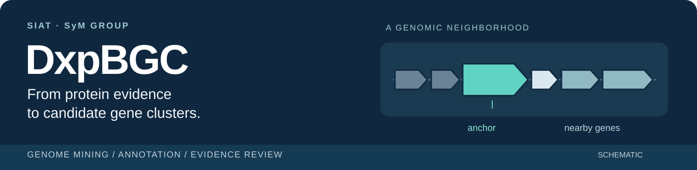
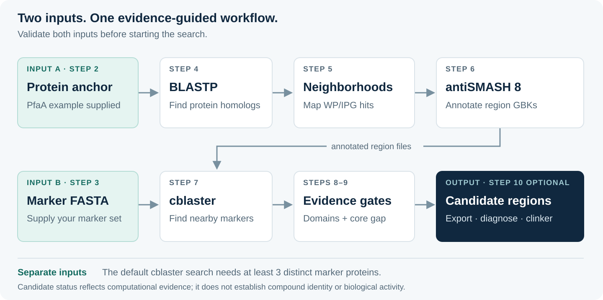

  

  
  &nbsp; · &nbsp; <a href="docs/user-guide.md"><strong>User guide</strong></a>
  &nbsp; · &nbsp; <a href="#what-you-get"><strong>Results</strong></a>
  &nbsp; · &nbsp; <a href="VALIDATION.md"><strong>Validation</strong></a>

**Find candidate biosynthetic gene clusters using protein homology, genomic proximity and domain evidence.** DxpBGC connects BLASTP, antiSMASH 8, cblaster and optional clinker visualization in a Colab workflow with resumable stages and saved evidence for every matched region.

**中文：**准备锚定蛋白和独立的多蛋白标记集，依次完成同源搜索、邻域注释与候选筛选；最后查看筛选依据和基因簇图。

## The workflow

## Start with two inputs

| Prepare | What to provide |
| :--- | :--- |
| **A · Protein anchor** | The original **AAN54658.1-PfaA, 2,531 aa** example is included. Replace it with your own protein sequence or FASTA when needed. |
| **B · Marker proteins** | Supply a **separate FASTA** with at least **3 distinct marker proteins** for the default `U=3`. A marker set is **not included** in this repository. |
| **Runtime** | Linux x86_64 CPU runtime, an NCBI contact email and space for the antiSMASH tools/databases. No GPU is needed. |

1. **Prepare · steps 0–3** — initialize the notebook, choose a workspace and validate both inputs.
2. **Mine · steps 4–6** — run or import BLAST, download neighborhoods and annotate with antiSMASH.
3. **Select · steps 7–9** — search the marker set, filter regions and review the evidence dashboard.
4. **Explore · step 10** — optionally compare exported candidates with clinker. Save the complete workspace.

> **Small demonstration by default.** The notebook starts with 10 BLAST hits and one representative taxid. These settings do not reproduce the full published candidate set. antiSMASH setup still takes substantial time and disk space. [Full setup instructions →](docs/user-guide.md#start-in-colab)

## What you get

| Result | Where to look | Use it to… |
| :--- | :--- | :--- |
| **Candidate evidence dashboard** | Step 9 · `diagnosis.html` | See passing/excluded counts, failed conditions and a preview of region-level evidence. The complete table is `filter_diagnosis.tsv`. |
| **Passing region list** | `kept_region_files.abs.txt` | Identify the exact passing GBKs. Complete report folders can also contain non-passing regions. |
| **Marker co-occurrence view** | cblaster · `plot.html` | Inspect the marker search alongside its session and tabular outputs. |
| **Gene-cluster comparison** | Optional clinker · `index.html` | Compare exported candidates. The default 20-region view limit leaves the full passing set intact. |
| **Traceable run** | Workspace manifests, logs and version records | Follow input accessions, coordinates, tool versions and cached stage outputs. |

The evidence dashboard reads the saved diagnosis; it does not rerun or reinterpret the filter. Zero passing regions is a valid result. Keep the complete `WORK_DIR` on persistent storage to retain checkpoints across runtime resets.

## How candidates are selected

All four evidence requirements must be met:

| Evidence | Default requirement |
| :--- | :--- |
| **PKS annotations** | `PKS_AT` and `ketoacyl synthase` in GenBank text, case-insensitively. |
| **Domain composition** | ≥2 PF00501 **or** ≥2 AMP-binding features, **and** ≥2 condensation features. Duplicate annotations of the same domain are counted once. |
| **Core proximity** | NRPS and hglE-KS cores on the same sequence record, with minimum gap **≤25,000 bp**. |
| **Product annotation** | An exact `NRPS` product annotation. |

These are computational candidates. Co-localization and domain evidence do not establish compound identity, bioactivity or experimentally demonstrated biosynthesis. [Exact filter semantics and parser limits →](docs/user-guide.md#filter-definition)

## Go deeper

| I want to… | Read |
| :--- | :--- |
| Change parameters or resume an interrupted run | [User guide](docs/user-guide.md) · [Recovery](docs/user-guide.md#recovery-and-provenance) |
| Understand files or troubleshoot a result | [Output map](docs/user-guide.md#outputs) · [Troubleshooting](docs/user-guide.md#troubleshooting) |
| Check what has actually been tested | [Validation record](VALIDATION.md) |
| Inspect or extend the workflow | [Analysis helpers](workflow_support.py) · [Display helpers](workflow_presentation.py) · [Development](docs/user-guide.md#development-and-validation) |
| Migrate older outputs | [Change log](CHANGELOG.md) |

Local validation covers recovery, cache behavior, filter boundaries and notebook structure. **Full Colab/antiSMASH execution, published-set reproduction and real-workload performance remain unvalidated.**

---

Maintained by [SIAT SyM Group](https://github.com/SIAT-SyM-Group). Licensed under [Apache 2.0](LICENSE); external tools and databases retain their own licenses.
